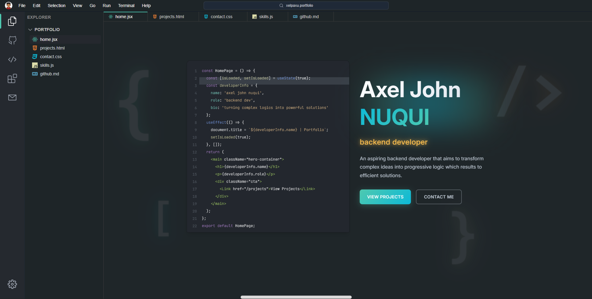

# 🚀 Axel John E. Nuqui — **PORTFOLIO**



[](https://reactjs.org/)
[](https://vitejs.dev/)
[](https://tailwindcss.com/)
[](https://vercel.com/)

🔗 **#[🌍 Live Demo](https://xelpaxu-portfolio.vercel.app)**

---

## 📌 **Project Information**

### ✨ Features
- **Home**
  - **Code-like** editor with basic descriptions of the owner
  - **Magnifying glass** on codes
  - **Blinking and glow effects** on texts
  - A **functioning terminal** with predefined codes for navigation

- **Projects**
  - Interactive project cards with **previews and GitHub links**  
  - **Hover animations** and smooth transitions  

- **Contact**
  - Simple, elegant section with **email and social links**  

---

### 🎨 Styling & UX
- **Tailwind CSS** → Scalable, utility-first styling  
- **Smooth hover animations** and **transitions**  
- **Desktop-first design** *(mobile responsiveness coming soon)*  

---

### ⚡ Performance
- **Vite** → Instant builds and optimized production output  

---

### 🛠️ Tech Stack
- **Build Tooling:** Vite  
- **UI/Styling:** Tailwind CSS  
- **Framework:** React  
- **Icons & UI:** React Icons  
- **Deployment:** Vercel  

---

## 📂 **Project Structure**
```
.
├─ public/ # Static assets (images, previews, favicon, etc.)
├─ src/
│ ├─ components/ # Reusable UI components
│ ├─ App.jsx # Main app component
│ ├─ main.jsx # React entry point
│ └─ index.css # Global styles
├─ package.json
├─ tailwind.config.js
├─ vite.config.js
└─ dist/ # Production build output
```

---

## ⚙️ **Prerequisites**
- **Node.js 18+ (recommended)**  

---

## 🚀 **Run this on your device**

🔹 **CLONE GITHUB LINK**
```bash
git clone https://github.com/xelpaxu/xelpaxu_portfolio.git
```
🔹 **Install Dependencies**
```bash
npm install
```
🔹 **Run Local Host**

```bash
npm run dev
```

🔹 **Run Preview**
```bash
npm run preview
```